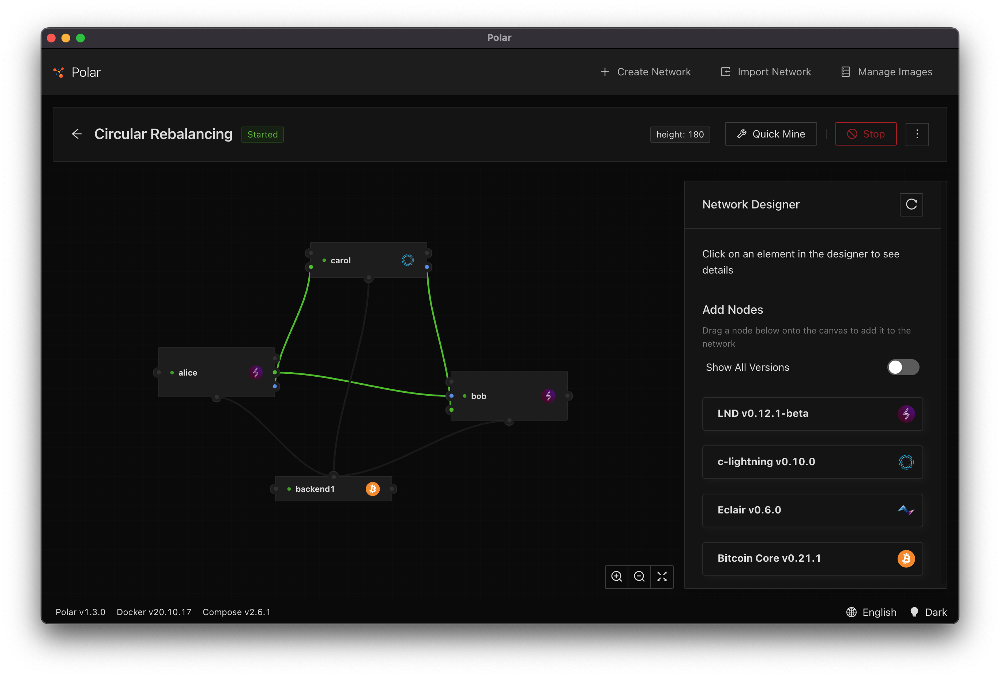

# Circular Rebalancing in the Lightning Network

Each Lighting Network channels has a total capacity. This total capacity is split between the two nodes in the channel. When a channel is initially opened (unless some amount is initially pushed to the remote node), the channel balance is 100% on one side of the person that created the channel. With this unbalance, a payment can only be sent. There is no inbound capacity. If you tried to receive a payment, it would fail.

Similarly, an channel that is opened to you will only have capacity on the remote side. Initially you can receive payments from that channel, but you will be unable send payments using that channel.

As you send and receive payments, the balances of your channels will shift. Ideally, you would want to maintain some split of inbound versus outbound capacity.

You can accomplish this by using **circular rebalancing**.

## Circular Rebalancing

Circular Rebalancing is a technique for when you have multiple channels open and want to change the inbound/outbound ratio for your channels. The general idea is that you pay yourself (only losing some fees along the way) using a channel that has excess outbound capacity and you accept payment through the channel that has excess inbound capacity. In this regard, the payment generates a circle and the net result is that your channel balances are more evenly distributed for both sending and receiving.

Create a Polar environment with three nodes: Alice, Bob, and Carol where:

- Alice opens a channel to Bob
- Bob opens a channel to Carol
- Carol opens a channel to Alice



In this environment, Alice has full outbound capacity one channel, and full inbound capacity on a second channel.

With this environment setup, lets see if we can perform a circular rebalance.

## Exercise: Rebalance Capacity Script

This script is located in `./execises/rebalancing/Run.ts`. This script does a few things:

1. constructs an LND client using the envrionment variables
1. accepts an amount in satoshis from the command line
1. accepts a comma separated list of node identifiers for how payments should be routed
1. obtains the starting balance of channels
1. creates an invoice for the amount specified
1. creates a circular route
1. sends the payment along that route
1. obtains the ending balance of channels

The first two items are obvious so we'll skip them for now.

### Node Identifiers

Next we need to split up a list of node public keys and convert strings into Buffers. The code for this is straightforward but the intent is a bit more confusing.

```
// Read the hop pubkeys as hex strings and convert them to buffers
const hop_pubkeys = process.argv[3].split(",").map(v => Buffer.from(v, "hex"));
```

What we want is a list nodes such that we start with a node we want to send to and end with our node. For example if we had outbound capacity from `Alice -> Bob` and inbound capacity from `Carol -> Alice` we want to send the payment using the `Alice -> Bob` channel, through the `Bob -> Carol` channel, then finally back to ourselves with the `Carol -> Alice` channel.

Our list of node identifiers would then correspond to those hops in the route: `pubkey(Bob),pubkey(Carol),pubkey(Alice)` or more concretely:

```
Alice=02a3cc61dd74a22f575b22f4ece6400f5754db9fab8a72a53b2a789ceca34a9d7e
Bob  =0227bfa020ce5765ef852555c5fbb58bdb3edbeb44f51b2eeb5e7167e678a2771e
Carol=0396e97fb9a10aaf7f1ccbe1fd71683863b9d279b3190f7561ceacd44d3e7a0791

0227bfa020ce5765ef852555c5fbb58bdb3edbeb44f51b2eeb5e7167e678a2771e,0396e97fb9a10aaf7f1ccbe1fd71683863b9d279b3190f7561ceacd44d3e7a0791,02a3cc61dd74a22f575b22f4ece6400f5754db9fab8a72a53b2a789ceca34a9d7e
```

You'll notice that the final node_id is always our node.

### Creating the Invoice

You'll notice in the steps that we create an invoice for the specified amount in satoshis.

```typescript
const invoice = await client.addInvoice({ amt });
```

This step is nothing special. In theory we could use keysend or another form of spontaneous payment instead generating the invoice ahead of time, but this allows us to create a custom memo if we wanted to do so.

### Creating the Route

Next you'll see that we need to construct a route from our list of nodes. We do this using the [`BuildRoute`](https://api.lightning.community/#buildroute) API. This API accepts a list of pubkeys. It goes through LNDs router to help us a build a path that is likely to succeed.

```typescript
// Build a route using the hop_pubkeys
const { route } = await client.buildRoute({
  final_cltv_delta: 40,
  hop_pubkeys,
  amt_msat,
});
```

The result of this call is a route that includes a series of hops that traverse channels through each of the specified nodes.

We need to do one outside the box thing to make the payment successful. We need to modify the last hop to include a payment secret. This `payment_secret` was initially added to prevent probing attacks and it is used to enable [multipath payments](https://github.com/lightning/bolts/commit/4c3d01616d8e7c1c39212f97562964eceb769c08). LND does not currently (as of v0.12.1-beta) have this baked into the `BuildRoute` API so we'll need to add this data manually to the `mpp_record` of our last hop:

```
route.hops[route.hops.length - 1].mpp_record = {
    payment_addr: invoice.payment_addr,
    total_amt_msat: amt_msat,
};
```

After that is said and done, we should have a route that is constructed that looks similar to this below. You can see that it has three hops: the first goes from `Alice -> Bob`, the second from `Bob -> Carol`, and the final goes from `Carol -> Alice` and includes the `payment_secret` value that will be included in the Onion TLV of the last hop.

```json
{
  hops: [
    {
      custom_records: {},
      chan_id: '192414534926337',
      chan_capacity: '250000',
      amt_to_forward: '50001',
      fee: '0',
      expiry: 260,
      amt_to_forward_msat: '50001050',
      fee_msat: '501',
      pub_key: '0396e97fb9a10aaf7f1ccbe1fd71683863b9d279b3190f7561ceacd44d3e7a0791',
      tlv_payload: true,
      mpp_record: null
    },
    {
      custom_records: {},
      chan_id: '185817465159681',
      chan_capacity: '250000',
      amt_to_forward: '50000',
      fee: '1',
      expiry: 220,
      amt_to_forward_msat: '50000000',
      fee_msat: '1050',
      pub_key: '0227bfa020ce5765ef852555c5fbb58bdb3edbeb44f51b2eeb5e7167e678a2771e',
      tlv_payload: true,
      mpp_record: null
    },
    {
      custom_records: {},
      chan_id: '118747255865345',
      chan_capacity: '250000',
      amt_to_forward: '50000',
      fee: '0',
      expiry: 220,
      amt_to_forward_msat: '50000000',
      fee_msat: '0',
      pub_key: '02a3cc61dd74a22f575b22f4ece6400f5754db9fab8a72a53b2a789ceca34a9d7e',
      tlv_payload: true,
      mpp_record: {
        payment_addr: <Buffer e8 68 fb fa e2 b4 91 0e 0a a3 9d 9a 52 e2 04 0a ef 45 ad a6 5e 9c ff 54 a9 d1 fd 6d 80 bd 4b e0>,
        total_amt_msat: '50000000'
      }
    }
  ],
  total_time_lock: 266,
  total_fees: '1',
  total_amt: '50001',
  total_fees_msat: '1551',
  total_amt_msat: '50001551'
}
```

Believe it or not, we just did it the easy way. If you have multiple channels open with a peer, it is likely that you would want to manually construct your first and last hops to ensure your route pays along the preferred path.

### Sending Payment to the Route

The last fun piece of coding is sending the payment along the route using the [`SendToRouteV2`](https://api.lightning.community/#sendtoroutev2) option. This method sends a payment for the hash along the route.

```typescript
const result = await client.sendToRouteV2(invoice.r_hash, route, false);
```

It will return a status of `SUCCEEDED` and the route that was used for payment if it was successful.

```json
{
  status: 'SUCCEEDED',
  route: {
    hops: [
      {
        custom_records: {},
        chan_id: '192414534926337',
        chan_capacity: '250000',
        amt_to_forward: '50001',
        fee: '0',
        expiry: 260,
        amt_to_forward_msat: '50001050',
        fee_msat: '501',
        pub_key: '0396e97fb9a10aaf7f1ccbe1fd71683863b9d279b3190f7561ceacd44d3e7a0791',
        tlv_payload: true,
        mpp_record: null
      },
      {
        custom_records: {},
        chan_id: '185817465159681',
        chan_capacity: '250000',
        amt_to_forward: '50000',
        fee: '1',
        expiry: 220,
        amt_to_forward_msat: '50000000',
        fee_msat: '1050',
        pub_key: '0227bfa020ce5765ef852555c5fbb58bdb3edbeb44f51b2eeb5e7167e678a2771e',
        tlv_payload: true,
        mpp_record: null
      },
      {
        custom_records: {},
        chan_id: '118747255865345',
        chan_capacity: '250000',
        amt_to_forward: '50000',
        fee: '0',
        expiry: 220,
        amt_to_forward_msat: '50000000',
        fee_msat: '0',
        pub_key: '02a3cc61dd74a22f575b22f4ece6400f5754db9fab8a72a53b2a789ceca34a9d7e',
        tlv_payload: true,
        mpp_record: {
          total_amt_msat: '50000000',
          payment_addr: <Buffer e8 68 fb fa e2 b4 91 0e 0a a3 9d 9a 52 e2 04 0a ef 45 ad a6 5e 9c ff 54 a9 d1 fd 6d 80 bd 4b e0>
        }
      }
    ],
    total_time_lock: 266,
    total_fees: '1',
    total_amt: '50001',
    total_fees_msat: '1551',
    total_amt_msat: '50001551'
  },
  attempt_time_ns: '1660757083463543000',
  resolve_time_ns: '1660757084439054000',
  failure: null,
  preimage: <Buffer a9 92 ad 78 42 04 f4 97 ca 96 99 8c 6f 01 67 7f 31 b6 50 38 0c 8a bb 4d 87 1b ec 9d 71 5c 5c 4e>,
  attempt_id: '2080'
}
```

### Complete View

You can view the complete code below:

```typescript
async function run(): Promise<void> {
  // Constructs a LND client from the environment variables
  const client = await ClientFactory.lndFromEnv();

  // Read the amount from the command line
  const amt = Number(process.argv[2]);

  // Read the hop pubkeys as hex strings and convert them to buffers
  const hop_pubkeys = process.argv[3].split(",").map(hexToBuf);

  // Convert the amount to millisatoshi
  const amt_msat = (amt * 1000).toString();

  // Load channels before
  const startChannels = await client.listChannels();

  // Construct a new invoice for the amount
  const invoice = await client.addInvoice({ amt });
  console.log(util.inspect(invoice, false, 10, true));

  // Build a route using the hop_pubkeys
  const { route } = await client.buildRoute({
    final_cltv_delta: 40,
    hop_pubkeys,
    amt_msat,
  });

  // Modify the last hop to include the payment_secret and total_amt_msat values
  route.hops[route.hops.length - 1].mpp_record = {
    payment_addr: invoice.payment_addr,
    total_amt_msat: amt_msat,
  };
  console.log(util.inspect(route, false, 10, true));

  // Send the payment for our invoice along our route
  const result = await client.sendToRouteV2(invoice.r_hash, route, false);
  console.log(util.inspect(result, false, 10, true));

  // Give channel balances time to settle
  await wait(1000);

  // Capture end channels
  const endChannels = await client.listChannels();

  // Output balance changes
  for (const start of startChannels.channels) {
    const end = endChannels.channels.find((e) => e.chan_id === start.chan_id);
    console.log(
      "channel",
      start.initiator ? "outgoing" : "incoming",
      start.chan_id,
      "start_balance",
      start.local_balance,
      "end_balance",
      end?.local_balance
    );
  }
}
```

### Running the Script

To run the script:

1. Gather the node_ids for Bob,Carol,Alice
1. Use `npm start exercises/reblancing/Run.ts <satshos> <comma_separated_list_of_nodes>

For example:

```
npm start exercises/rebalancing/Run.ts 10000 \
0227bfa020ce5765ef852555c5fbb58bdb3edbeb44f51b2eeb5e7167e678a2771e,0396e97fb9a10aaf7f1ccbe1fd71683863b9d279b3190f7561ceacd44d3e7a0791,02a3cc61dd74a22f575b22f4ece6400f5754db9fab8a72a53b2a789ceca34a9d7e
```

## Afterthoughts

Rebalancing is a complicated but necessary action for many node operators. Many tools already exist for this:

**LND**:

- [Rebalance LND](https://github.com/C-Otto/rebalance-lnd)
- [Balance of Satoshis](https://github.com/alexbosworth/balanceofsatoshis)

**C-Lightning**:

- [Rebalance Plugin](https://github.com/lightningd/plugins/tree/master/rebalance)
