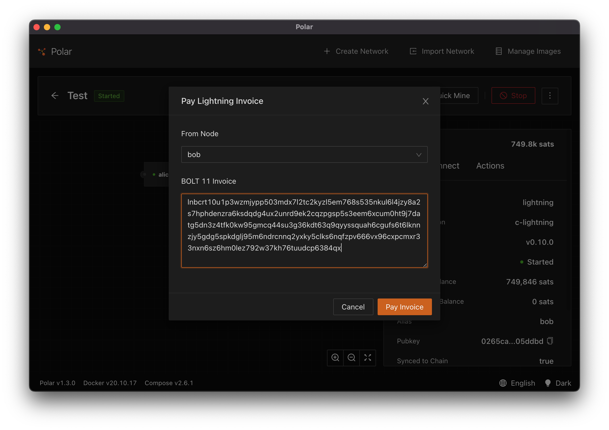

# Hold Invoices

Hold invoices (sometimes referred to as hodl invoices) are a mechanism for delaying the settlement of an invoice. Typically upon receipt of a payment, the recipient releases the preimage to settle the incoming HTLC. With hold invoices, the release of the preimage is not automatic.

Let's consider a scenario with a typical invoice. Bob is paying Alice for a book. Alice creates the invoice for the book and provides it to Bob. Bob pays the invoice and it is immediately settled when Alice's node receives payment. Alice now has the funds. Alice goes and looks for the book, but alas she is sold out. She needs to refund Bob his money. Alice has to ask Bob to create an invoice so she can refund his money then make a payment to him.

This is obviously cumbersome. Additionally, Alice and Bob are likely to lose out on routing fees along the way.

With a hold invoice, after payment is received, the merchant can validate some condition and then settle the transaction. With our example above, Alice delays settlement after she receives Bob's payment. She can verify that she has the book. If she does have the book she settles the transaction. If she doesn't have the book she can cancel the invoice and Bob is immediately returned his funds as if the payment failed.

This brings up two points:

1. Hold invoices look just like normal invoices to Bob, so if Alice cancels his payment, she must notify him that it was cancelled.
2. Hold invoices tie up funds along the route. This behavior is similar to an actual attack vector on Lightning known as a griefing attack. So if you use hold invoices, it is best to settle them as soon as possible.

Beyond refunds, hold invoices have a few other uses:

- **Fidelity bonds** - you can think of this as a deposit on good behavior. A payment can be made to a service provider to access the service. If the user is not malicious the invoice can be cancelled. If the user misbehavior, the invoice can be settled and the funds in the bond taken by the service provider.
- **Atomic delivery** - the buyer of some good generates a preimage. The buyer pays the invoice and the merchant has payment. The merchant can send the good. Upon delivery a courier/third party collects and verifies the preimage and provides it to the merchant who can now access the funds.
- **Swaps** - Alice wants to move funds from a channel to her on-chain wallet. She creates a preimage and provides the hash to Bob. Bob runs a swap service and constructs a hold invoice using the hash. When he receives payment from Alice he will pay an HTLC on-chain that can be resolved via the preimage. Once Alice sees this HTLC, she can claim the funds with the preimage. Alice now has the funds on-chain and Bob is able to settle the hold invoice.

These examples highlight an interesting aspect of the hold invoice: the preimage of an invoice can be unknown to the invoice creator.

Now that you have a good understanding of hold invoices, we'll do a few exercises to use them via code.

## Exercise: Creating a Hold Invoice

The first exercise is creating a hold invoice using a script. We'll start by using the command line script at `/exercises/hold-invoices/Hash.ts` to create a preimage and its hash from some arbitrary data.

```
npm start "exercises/hold-invoices/Hash.ts" -- "example 1"
```

Dev note: Because we are using an `npm` script to start our file, we need to differentiate between arguments that are provided to the `npm` command and those that we want to pass to the script. This is done with `--`. As you can see, the first argument that is provided to the script is `"example 1"`.

Running this script will output the raw data, the 32-byte preimage for this data, and the
hash of the preimage.

```
data:      example 1
preimage:  8ee89711330c1ccf39a2e65ad12bbd7df4a4a2ee857f53b4823f00fecb7bd252
hash:      964e1161e2b41cb66982453a4b7b154750e26b04c63116f9ef8e3b1adb30e71a
```

Take a look at the code in `Hash.ts`

```typescript
// /exercises/hold-invoices/Hash.ts
async function run() {
  // read the command line argument, first value starts at index 2.
  const data = process.argv[2];

  // hash the raw data to make it 32-bytes
  const preimage = sha256(data);

  // hash the preimage value
  const hash = sha256(preimage);

  console.log("data:     ", data);
  console.log("preimage: ", preimage.toString("hex"));
  console.log("hash:     ", hash.toString("hex"));
}
```

This script accepts any value on the command line. This value will be used to generate the preimage. Lightning Network preimages must be 32-bytes, so we use the SHA256 hash function to turn the arbitrary length value into 32-bytes.

Once we have the 32-byte preimage we can convert it into the hash used in the invoice. As we previously discussed, in order to create a hold invoice only requires knowledge of the hash, so in this example we could have received a hash from a third party and it would be ok that we have no knowledge of the actual preimage.

Next we'll use the create script to build our invoice by passing in the hash value.

```
npm start "exercises/hold-invoices/Create.ts" -- 964e1161e2b41cb66982453a4b7b154750e26b04c63116f9ef8e3b1adb30e71a
```

This will return a result with the payment request information as if it was a normal invoice.

```
{
  payment_request: 'lnbcrt10u1p3wzutmpp5je8pzc0zkswtv6vzg5ayk7c4gagwy6cyccc3d7003ca34kesuudqdqdg4ux2unrd9ek2cqzpgsp5z3qeuh5eq6dfuyemgkkk95y0r2cfek6s08cvaze0q6w28dphxmys9qyyssqgxxde9netfts3g8gkqv2hmaj8fety2vjjp67utn8vnp8u6uw6cr33c0g4fnjw029m68rmn2lumwnxgs4rvp0tj47lrkuptcwu7dz2xcp2jx3a2',
  add_index: '0',
  payment_addr: <Buffer >
}
```

Take a look at the `run` function in `/exercises/hold-invoices/Create.ts` to see how to use the `AddHoldInvoice` API of LND.

```typescript
async function run(): Promise<Lnd.AddHoldInvoiceResult> {
  // Expects the hash as 32-byte hex
  const hash = Buffer.from(process.argv[2], "hex");

  // Constructs a LND client from the environment variables
  const client = await ClientFactory.lndFromEnv();

  // Finally construct the HOLD invoice
  const options: Lnd.AddHoldInvoiceInput = {
    memo: "Exercise",
    value: "1000",
    hash,
  };
  return await client.addHoldInvoice(options);
}
```

This invoice can then be provided to Bob so that he can pay it.



Instead of completing, you'll see that the payment looks "stuck". That's because the payment hasn't settled yet. Alice will either need to settle or cancel the invoice.

## Exercise: Cancelling the Hold Invoice

Next we'll see what happens if Alice wants to cancel the invoice.

We use the `Cancel` script using the hash value that we generated.

```
npm start "exercises/hold-invoices/Cancel.ts" -- 964e1161e2b41cb66982453a4b7b154750e26b04c63116f9ef8e3b1adb30e71a
```

We should also see that the payment in polar has failed.

Take a look at the `/exercises/hold-invoices/Cancel.ts` script to see how we call the `CancelInvoice` API of LND.

```typescript
async function run(): Promise<void> {
  // Expects the hash as a 32-byte hex encoded argument
  const hash = Buffer.from(process.argv[2], "hex");

  // Constructs a LND client from the environment variables
  const client = await ClientFactory.lndFromEnv();

  // Finally we can cancel the invoice.
  return await client.cancelInvoice(hash);
}
```

## Exercise: Settling an Invoice

Alice cancelled the last invoice that was generated. This time we'll try settling an invoice. To do this we need to generate a new hold invoice. We start by creating a new hash/preimage pair.

```
npm start "exercises/hold-invoices/Hash.ts" -- "example settle"
```

This will result in output that looks like:

```
data:      example settle
preimage:  64b64bad988b06b70973f995c80acc132ec22044984d57d799a6d09a31bec3e1
hash:      33f35509e040e0cc653691caa22f99e4d7fcaf714f2bcdda13ce369ca844f979
```

With the new preimage we can create a new invoice using the `Create` script.

```
 npm start "exercises/hold-invoices/Create.ts" -- 33f35509e040e0cc653691caa22f99e4d7fcaf714f2bcdda13ce369ca844f979
```

This will generate a new payment request that Bob can try to pay again.


Instead of cancelling, this time Alice is going to settle the invoice.

She can settle it using the `Settle` script and providing the preimage `64b64bad988b06b70973f995c80acc132ec22044984d57d799a6d09a31bec3e1`.

```
npm start "exercises/hold-invoices/Settle.ts" -- 64b64bad988b06b70973f995c80acc132ec22044984d57d799a6d09a31bec3e1
```

This time, Bob should see the invoice successfully paid!

You can check out the `Settle` script that shows how to use the `SettleInvoice` API of LND.

```typescript
async function run(): Promise<void> {
  // Expects the preimage in the command line is a 32-byte hex encoded value
  const preimage = Buffer.from(process.argv[2], "hex");

  // Constructs a LND client from the environment variables
  const client = await ClientFactory.lndFromEnv();

  // Settle the invoice using the 32-byte preimage
  return await client.settleInvoice(preimage);
}
```
