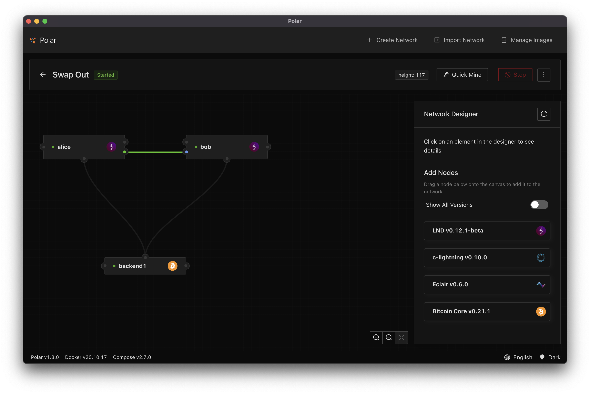

# Building a Reverse Submarine Swap Service for the Lightning Network

In this section we'll discuss reverse submarine swaps in a Lightning Network channel using [hold invoices](./hold_invoices.md). When performing an reverse submarine swap aka swap-out, it is the ability to move funds from an off-chain Lightning Network channel to an on-chain address in a trustless way.

An obvious use case for this is a merchant that a receives a large inflow of payments via Lightning. At a certain point the merchant Lightning channel inbound capacity will be exhausted and the merchant. A swap-out allows the merchant to simultaneously change the balance of their channel so that they once again have inbound capacity and move the funds to an on-chain address for safe keeping!

This article is going to show how to build a simple reverse submarine swap service. There are a lot of moving pieces and we need to have on-chain wallet capabilities. In order to keep this article somewhat brief we'll forgo building a fully complete and secure swap service and instead work through the mechanics. The full working code can be found [here](https://github.com/bmancini55/building-lightning-advanced/tree/main/exercises/swap-out).

## Mechanics of Swap-Out

Each swap-out will generate at least two on-chain transaction: one on-chain HTLC and one claim transaction to resolve the HTLC. Performing a swap-out require a service that bridges off-chain Lightning Network payments to on-chain transaction. Functionally the service will broadcast an on-chain HTLC that can be claimed with the hash preimage by the person requesting the swap-out.

So here are the steps for a swap-out between Alice and Bob. Bob runs a swap-out service and Alice wants to migrate some funds on-chain.

1. Alice generates a hash preimage that only she knows and provides the hash, a payment address, and the amount to Bob
1. Bob generates a hold invoice and provides the payment request and his refund address to Alice
1. Alice pays the invoice using her Lightning Network node
1. Bob gets receipt of the payment,
1. Bob broadcasts an on-chain HTLC that pays Alice if she provides the preimage or it pays him after some timeout period
1. Alice settles the on-chain HTLC by spending it using the preimage (Alice now has her funds on-chain)
1. Bob extracts the preimage from the Alice's settlement transaction on-chain
1. Bob settles the inbound hold invoice (Bob now has funds in his LN channel)


Astute readers will recognize that the on-chain HTLC aspect is remarkably similar to how Lightning Network channels make claims against HTLCs when a channel goes on-chain. In order to settle the HTLC outputs one of two things happens:

1. the offerer of an HTLC has access to reclaim the funds after some timeout period
1. the recipient of an HTLC can claim the funds using the preimage

With swaping it's much simpler than inside a channel. In our example, Alice can claim the on-chain HTLC using the preimage that she knows. If she does this, then Bob can extract the preimage and settle the off-chain HTLC so that he doesn't lose funds.

One final note is that just like off-chain payments, to ensure there are no funds lost, the timeouts must be larger for incoming HTLCs than the corresponding outgoing HTLC. This ensures that an outgoing HTLC is always fully resolve before the incoming HTLC can be timed out.

## Building a Swap-Out Client

The first step is going to be building a client for Alice. To make our lives easier this client will connect to the service over HTTP to exchange necessary information.

Once the client has an invoice it will:

1. pay the invoice
1. watch the blockchain for the HTLC
1. spend the HTLC using the preimage that it knows

The code for our client application can be found in [`exercises/swap-out/client/Client.ts`](https://github.com/bmancini55/building-lightning-advanced/blob/main/exercises/swap-out/client/Client.ts). The start of this file contains a few boilerplate things that must be setup:

1. Connect to our Lightning Network node (we use LND again for this example)
2. Connect to our `bitcoind` node
3. Construct a blockchain monitor that will notify our application when blocks are connected
4. Construct a wallet for storing our keys

After this boilerplate, our application needs to generate the information needed by the swap-out service. In this application we'll use `@node-lightning/bitcoin` library to perform basic Bitcoin functionality. We'll use our wallet to create a new private key. We'll share this with the service using a P2WPKH address.

```typescript
const htlcClaimPrivKey = wallet.createKey();
const htlcClaimPubKey = htlcClaimPrivKey.toPubKey(true);
const htlcClaimAddress = htlcClaimPubKey.toP2wpkhAddress();
logger.info("generated claim address", htlcClaimAddress);
```

_Note_: Why are we using a P2WPKH address instead of a 33-byte public key directly? We could send a 33-byte compressed pubkey, a 20-byte pubkeyhash, or a Bitcoin address (an encoded pubkeyhash). Since we'll be sharing these values over HTTP JSON addresses provide the least ambiguity as to the meaning of the data.

Now we'll create a random preimage and the hash defined as `sha256(preimage)`. The hash will be used in the invoice and the HTLC construction.

```typescript
const preimage = crypto.randomBytes(32);
logger.info("generated preimage", preimage.toString("hex"));

const hash = sha256(preimage);
logger.info("generated hash", hash.toString("hex"));
```

With that information we'll make a simple HTTP request to the service:

```typescript
const apiRequest: Api.SwapOutRequest = {
  htlcClaimAddress: htlcClaimAddress,
  hash: hash.toString("hex"),
  swapOutSats: Number(htlcValue.sats),
};
```

When executed will look something like

```
{
  "htlcClaimAddress": "bcrt1qsnaz83m800prgcgp2dxvv5f9z2x4f5lasfekj9",
  "hash": "c8df085d2d3103e944b62d20fe6c59e117ffec97443f76581434e0ea0af9d7ea",
  "swapOutSats": 10000
}
```

We make the web request

```typescript
const apiResponse: Api.SwapOutResponse = await Http.post<Api.SwapOutResponse>(
  "http://127.0.0.1:1008/api/swap/out",
  apiRequest
);
```

The response will contain a Lightning Network payment request and the refund address owned by the service in case we fail to fulfill the on-chain HTLC in time. We now have everything we need to reconstruct the on-chain HTLC.

A sample response looks like:

```
{
  "htlcRefundAddress": "bcrt1qgmv0jaj36y8v0mlepswd799sf9q7tparlgphe2",
  "paymentRequest": "lnbcrt110u1p3j8ydrpp5er0sshfdxyp7j39k95s0umzeuytllmyhgslhvkq5xnsw5zhe6l4qdqqcqzpgsp55wn3hnhdn3sp4av8t7x5qfpvy4vsdgpyqg6az7gy7fqfg75j49aq9qyyssqpgsjc2y7wvdh7gvg4kyp8lnsv5hgzr0r3xyw0rfydyue9he40wfxzxnp0rcm2lge5qv8hrhfs7j6ecq9r6djwu8z3vuzpqr306g790qqh5kejs"
}
```

We can then use the [`sendPaymentV2`](https://api.lightning.community/#sendpaymentv2) method of LND to pay the payment request.

```typescript
await lightning.sendPaymentV2(
  { payment_request: apiResponse.paymentRequest, timeout_seconds: 600 },
  (invoice) => {
    logger.info("invoice status is now:" + invoice.status);
  }
);
```

However! Before we make the payment request we want start watching the blockchain for the HTLC. To watch for the HTLC we need to look for a transaction that has a P2WSH output matching our HTLC. Recall that P2WSH outputs use Script that is `0x00+sha256(script)`. Only when the output is spent is the script revealed as part of the witness. So for our purposes we want to construct the HTLC Script but then convert it into a P2WSH ScriptPubKey.

Constructing the script uses the [`createHtlcDescriptor`](https://github.com/bmancini55/building-lightning-advanced/blob/main/exercises/swap-out/CreateHtlcDescriptor.ts) method which generates a Script that looks like:

```
OP_SHA256
<32-byte hash>
OP_EQUAL
OP_IF
    OP_DUP
    OP_HASH160
    <20-byte claim pubkeyhash>
OP_ELSE
    28
    OP_CHECKSEQUENCEVERIFY
    OP_DROP
    OP_DUP
    OP_HASH160
    <20-byte refund pubkeyhash>
OP_ENDIF
OP_EQUALVERIFY
OP_CHECKSIG
```

We are going to use the `pubkeyhash` construction inside our HTLCs as defined in [BIP199](https://github.com/bitcoin/bips/blob/master/bip-0199.mediawiki). This saves us 21-bytes compared to using 33-byte public keys and `OP_CHECKSIG`. Also if you recall from above where the client and server exchange information, this is why we can use Bitcoin P2WPKH addresses instead of sharing public keys.

Now that we have the HTLC script, we'll perform a sha256 on this script to convert it into the P2WSH ScriptPubKey. We'll serialize it to a hex string for simple comparison when we receive a block.

```typescript
const htlcScriptPubKeyHex = Bitcoin.Script.p2wshLock(htlcDescriptor)
  .serializeCmds()
  .toString("hex");
```

The result will look like:

```
00<32-byte sha256(htlc_script)>
```

Now that we know what to watch for, we can start watching blocks. To do this we use the [`BlockMonitor`](https://github.com/bmancini55/building-lightning-advanced/blob/main/exercises/swap-out/BlockMonitor.ts) type which allows us to scan and monitor the blockchain.

```typescript
monitor.addConnectedHandler(async (block: Bitcoind.Block) => {
  for (const tx of block.tx) {
    for (const vout of tx.vout) {
      if (vout.scriptPubKey.hex === htlcScriptPubKeyHex) {
        // Upon finding the HTLC on-chain, we will now generate
        // a claim transaction
        logger.info("found on-chain HTLC, broadcasting claim transaction");
        const claimTx = createClaimTx(
          htlcDescriptor,
          preimage,
          htlcClaimPrivKey,
          htlcValue,
          `${tx.txid}:${vout.n}`
        );

        // Broadcast the claim transaction
        logger.debug("broadcasting claim transaction", claimTx.toHex());
        await wallet.sendTx(claimTx);
      }
    }
  }
});
```

The above code attaches a handler function that is executed for each block. We check each output by looking at the `scriptPubKey`. If it matches the previously computed `scriptPubKeyHex` of our HTLC then we have found the HTLC!

When we see the HTLC on-chain, we construct our claim transaction using the [`createClaimTx`](https://github.com/bmancini55/building-lightning-advanced/blob/main/exercises/swap-out/client/CreateClaimTx.ts) method. The claim transaction is defined as:

- version: 2
- locktime: 0xffffffff
- txin count: 1
  - `txin[0]` outpoint: `txid` and `output_index` of the on-chain HTLC
  - `txin[0]` sequence: 0xffffffff
  - `txin[0]` scriptSig bytes: 0
  - `txin[0]` witness: `<claim_signature> <claim_pubkey> <preimage> <htlc_script>`
- txout count: 1
  - `txout[0]` value: `htlc_amount` less `fee` (fee currently fixed at 1sat/byte = 141)
  - `txout[0]` scriptPubKey : `00<20-byte claim pubkey hash>`

We broadcast our claim transaction and our mission is complete! We have successfully moved funds from our Lightning Network channel to our claim pubkey address.

Next we'll take a look at the service.

## Building a Swap-Out Service

The service piece is a bit more complicated. As discussed, our service needs to do a few things:

1. Receive requests and create a hold invoice
1. Upon receipt of a hold invoice payment, construct an on-chain HTLC
1. Watch the HTLC for settlement
1. Extract the preimage from the on-chain settlement and resolve the incoming hold invoice

I like to think of a request in its various states and we can model this as such:


For the sake of simplicity, we'll be ignore the timeout paths (dotted lines). As a result our states will traverse through a linear progression of events.

The [entrypoint](https://github.com/bmancini55/building-lightning-advanced/blob/main/exercises/swap-out/service/Service.ts) of the service includes some boilerplate to connect to our LND node, connect to bitcoind, and start an HTTP API to listen for requests.

Another thing that happens at the entry point is that our service adds funds to our wallet using the [`fundTestWallet`](https://github.com/bmancini55/building-lightning-advanced/blob/e6a505c80e3cc719d50361d614f2ea8954916576/exercises/swap-out/Wallet.ts#L41) method. Our wallet implementation runs on regtest which allows us to generate funds and blocks as we need them. The funds in our wallet will be spent to the on-chain HTLC that the service creates after we receive payment of an incoming hold invoice.

Once we have some funds ready to go we can start our [API](https://github.com/bmancini55/building-lightning-advanced/blob/main/exercises/swap-out/service/Api.ts) and listen for requests. The API simply translates those requests from JSON and supplies the resulting request object into the [`RequestManager`](https://github.com/bmancini55/building-lightning-advanced/blob/main/exercises/swap-out/service/RequestManager.ts) which is responsible for translating events into changes for a request.

Let's now work our way through the service and discuss what happens.

When a request first comes in our we do a few things in the [`addRequest`](https://github.com/bmancini55/building-lightning-advanced/blob/e6a505c80e3cc719d50361d614f2ea8954916576/exercises/swap-out/service/RequestManager.ts#L41) method of the `RequestManager`.

1. Create a new key for the timeout path of our on-chain HTLC
1. Generate a hold invoice payment request that is for the requested amount + fees we want to charge for swaping-out.
1. Start watching for changes to the invoice.

At this point the service can send back the payment request an the refund address we just created.

Our request is now `awaiting_incoming_htlc_acceptance`, meaning we are waiting for the requestor to pay the invoice before we broadcast the on-chain HTLC.

When the requestor finally pays the invoice our service will be notified that the LN payment has been accepted. This will trigger the [`onHtlcAccepted`](https://github.com/bmancini55/building-lightning-advanced/blob/e6a505c80e3cc719d50361d614f2ea8954916576/exercises/swap-out/service/RequestManager.ts#L81) method of the `RequestManager`. This method will construct and broadcast our HTLC transaction.

To construct the the HTLC transaction we use [`createHtlcTx`](https://github.com/bmancini55/building-lightning-advanced/blob/e6a505c80e3cc719d50361d614f2ea8954916576/exercises/swap-out/service/RequestManager.ts#L181) method. The transaction is constructed according to the following:

- version: 2
- locktime: 0xffffffff
- txin count: 1
  - `txin[0]` outpoint: some available UTXO from our wallet
  - `txin[0]` sequence: 0xffffffff
  - `txin[0]` scriptSig bytes: 0
  - `txid[0]` witness: standard p2wpkh spend
- txout count: 2
  - `txout[0]` value: `htlc_amount` less `service_fee` (cost to swap-out is set at 1000 sats)
  - `txout[0]` scriptPubKey : `00<32-byte sha256(htlc_script)>`
  - `txout[1]` value: change amount
  - `txout[1]` scriptPubKey: p2wpkh change address

As we discussed in the previous section our transaction will contain one P2WSH output with the HTLC script. It pays out the amount specified in the swap-out request less the fees we use for service. Recall that the script we use for this is:

```
OP_SHA256
<32-byte hash>
OP_EQUAL
OP_IF
    OP_DUP
    OP_HASH160
    <20-byte claim pubkeyhash>
OP_ELSE
    28
    OP_CHECKSEQUENCEVERIFY
    OP_DROP
    OP_DUP
    OP_HASH160
    <20-byte refund pubkeyhash>
OP_ENDIF
OP_EQUALVERIFY
OP_CHECKSIG
```

The input and second change output are generated by our wallet's [`fundTx`](https://github.com/bmancini55/building-lightning-advanced/blob/e6a505c80e3cc719d50361d614f2ea8954916576/exercises/swap-out/Wallet.ts#L112) method. The wallet is capable of finding a spendable UTXO and manages adding a change address. This method is a simplification, but our swap-out service would also need to aware of whether funds were available to perform the on-chain transaction. We simplify it by always funding the wallet and assuming we have access to the funds.

After the HTLC transaction is constructed we broadcast it.

Our request is now in the `awaiting_onchain_htlc_claim` state. We are waiting for the requestor to claim the HTLC by spending it using the preimage path. In order to determine if the HTLC has been spent we use the block monitor to watch for spends out of HTLC outpoint. We do this with the [`checkBlockForSettlement`](https://github.com/bmancini55/building-lightning-advanced/blob/e6a505c80e3cc719d50361d614f2ea8954916576/exercises/swap-out/service/RequestManager.ts#L129) method of the `RequestManager`:

```typescript
protected async checkBlockForSettlements(block: Bitcoind.Block): Promise<void> {
    for (const tx of block.tx) {
        for (const input of tx.vin) {
            // Ignore coinbase transactions
            if (!input.txid) continue;

            // Construct the outpoint used by the input
            const outpoint = new Bitcoin.OutPoint(input.txid, input.vout);

            // Find the request that corresponds to this HTLC spend
            const request = this.requests.find(
                p => p.htlcOutpoint.toString() === outpoint.toString(),
            );

            // If we found a request we can now process the invoice
            if (request) {
                await this.processClaimTransaction(input, request);
            }
        }
    }
}
```

When we find a transaction that spends the HTLC outpoint, it means that the requestor has spent the output using the preimage path. We need to extract the preimage so we can settle the incoming hold invoice. We do this with the [`processClaimTransaction`](https://github.com/bmancini55/building-lightning-advanced/blob/e6a505c80e3cc719d50361d614f2ea8954916576/exercises/swap-out/service/RequestManager.ts#L158) method of the `RequestManager` which simply extracts the preimage from the witness data that was used to claim the HTLC. If you recall from the previous section when the claim transaction is build the witness data used to spend the HTLC UTXO is `[<claim_sig>, <claim_pubkey>, <preimage>, <htlc_script>]`.

```typescript
protected async processClaimTransaction(input: Bitcoind.Input, request: Request) {
    request.logger.info("event: block_connected[htlc_spend]");

    // Extract the preimage from witness data. It will
    // always be the third witness value since the values
    // are [signature, pubkey, preimage]
    const preimage = Buffer.from(input.txinwitness[2], "hex");

    // Using the obtained preimage, settle the invoice so
    // we can receive our funds
    if (preimage.length) {
        request.logger.info("action: settle invoice, preimage=", preimage.toString("hex"));
        await this.invoiceMonitor.settleInvoice(preimage);
    }
}
```

Once the preimage is extracted we finally settle the hold invoice and retrieve our funds!

## Try it out!

You can try it out with Alice and Bob. In this example, Bob is running the service and Alice wants to swap-out funds from a channel that has the full balance on her side.

Using [Lightning Polar](https://lightningpolar.com/), create a new environment with two LND nodes (one for Alice and one for Bob) and a single bitcoind back end node.



Create a channel from Alice to Bob. This will ensure that all the funds are on Alice's side of the channel.

If you haven't already, clone the [code repository](https://github.com/bmancini55/building-lightning-advanced) and run `npm install`.

Copy `.env-sample` to `.env` and configure the follow values from the running Polar environment.

```
# SWAP OUT - ALICE
ALICE_LND_RPC_HOST=
ALICE_LND_CERT_PATH=
ALICE_LND_ADMIN_MACAROON_PATH=

# SWAP OUT - BOB
BOB_LND_RPC_HOST=
BOB_LND_CERT_PATH=
BOB_LND_ADMIN_MACAROON_PATH=

# SWAP OUT - BITCOIND
BITCOIND_RPC_URL=
BITCOIND_RPC_USER=
BITCOIND_RPC_PASSWORD=
```

You should now be able to start the server with (which will be run by Bob):

```
npm start exercises/swap-out/service/Service.ts
```

In a separate command line instance start the client from Alice's perspective with:

```
npm start exercices/swap-out/service/Client.ts
```

The client should output something like the following:

```
> npm start exercises/swap-out/client/Client.ts

> building-lightning-advanced@1.0.0 start
> ts-node "exercises/swap-out/client/Client.ts"

2022-09-16T19:33:13.674Z [DBG] Wallet: adding bcrt1qmmj0kjmklc0zyy62cv4ah4mpzftl0mpcacjzl0
2022-09-16T19:33:13.675Z [INF] SwapOutService: generated claim address bcrt1qmmj0kjmklc0zyy62cv4ah4mpzftl0mpcacjzl0
2022-09-16T19:33:13.675Z [INF] SwapOutService: generated preimage 0353725431741829e4d8aa1c4043143a17b054f9d91ef4e442686a0b63e8a0cc
2022-09-16T19:33:13.675Z [INF] SwapOutService: generated hash 9a6de8835775903af1551d43a24b3e06f7a2c9a8c5f07d40505250c5cc325f5d
2022-09-16T19:33:14.635Z [DBG] SwapOutService: service request {
  htlcClaimAddress: 'bcrt1qmmj0kjmklc0zyy62cv4ah4mpzftl0mpcacjzl0',
  hash: '9a6de8835775903af1551d43a24b3e06f7a2c9a8c5f07d40505250c5cc325f5d',
  swapOutSats: 10000
}
2022-09-16T19:33:14.673Z [DBG] SwapOutService: service response {
  htlcRefundAddress: 'bcrt1qkh0382sjs5yk5fpy0xvuyra3kqjyg2n63c66jw',
  paymentRequest: 'lnbcrt110u1p3jfnm6pp5nfk73q6hwkgr4u24r4p6yje7qmm69jdgchc86szs2fgvtnpjtawsdqqcqzpgsp52kwapautlasnwtxrykvd5c33pgtdpyemp0667jayla7r5qd4nvjq9qyyssqkahaj2jl3qhhws385xfxxytckyw95mvgp0rz4e58x0lfrxm9gy0yy68uzx8gv790596jdxh028g709vptw67f8vusnlvvnc6efkr4jqqhukl50'
}
2022-09-16T19:33:14.673Z [DBG] SwapOutService: constructed HTLC script OP_SHA256 9a6de8835775903af1551d43a24b3e06f7a2c9a8c5f07d40505250c5cc325f5d OP_EQUAL OP_IF OP_DUP OP_HASH160 dee4fb4b76fe1e22134ac32bdbd7611257f7ec38 OP_ELSE 28 OP_CHECKSEQUENCEVERIFY OP_DROP OP_DUP OP_HASH160 b5df13aa1285096a24247999c20fb1b024442a7a OP_ENDIF OP_EQUALVERIFY OP_CHECKSIG
2022-09-16T19:33:14.673Z [DBG] SwapOutService: constructed HTLC scriptPubKey 0020d329c680878d6f1ed02c1977b792907960e83741c0a8fa710d9e8e1d1064aec8
2022-09-16T19:33:14.674Z [INF] SwapOutService: paying invoice
(node:47881) [DEP0123] DeprecationWarning: Setting the TLS ServerName to an IP address is not permitted by RFC 6066. This will be ignored in a future version.
(Use `node --trace-deprecation ...` to show where the warning was created)
2022-09-16T19:33:14.709Z [INF] SwapOutService: invoice status is now:IN_FLIGHT
2022-09-16T19:33:14.736Z [INF] SwapOutService: invoice status is now:IN_FLIGHT
2022-09-16T19:33:15.676Z [INF] SwapOutService: found on-chain HTLC, broadcasting claim transaction
2022-09-16T19:33:15.678Z [DBG] SwapOutService: broadcasting claim transaction 02000000000101b3bbc595448889119329cff40003d64c4f0d3ca39d38e676bc0e2885d10adb070000000000ffffffff018326000000000000160014dee4fb4b76fe1e22134ac32bdbd7611257f7ec38044730440220359873e5ea1a7d902ccddb89802adf44c83b1e5fa742858434d4dafe2661e8a302204862536b12bde0f8a1e1b4d7ce97bfeb2c991956a794ae921f67d11445ffcb31012102bda5f9de10b11b30d4161a7b8595937468f1f246a2bacd127575a1709d3414f9200353725431741829e4d8aa1c4043143a17b054f9d91ef4e442686a0b63e8a0cc5aa8209a6de8835775903af1551d43a24b3e06f7a2c9a8c5f07d40505250c5cc325f5d876376a914dee4fb4b76fe1e22134ac32bdbd7611257f7ec38670128b27576a914b5df13aa1285096a24247999c20fb1b024442a7a6888acffffffff
2022-09-16T19:33:15.678Z [INF] Wallet: broadcasting txid 5b62d53e255ff507f40342de79458eec4a65065056821e670add4a2119dd5274
2022-09-16T19:33:16.318Z [INF] SwapOutService: invoice status is now:SUCCEEDED
```

On Bob's side of the fence we should see the service output something like the following:

```
npm start exercises/swap-out/service/Service.ts

> building-lightning-advanced@1.0.0 start
> ts-node "exercises/swap-out/service/Service.ts"

2022-09-16T19:33:06.880Z [DBG] Wallet: adding bcrt1qvcu45durgylgw7s55ecupqccnwr3xy6en302wy
2022-09-16T19:33:06.881Z [DBG] Wallet: adding funds to bcrt1qvcu45durgylgw7s55ecupqccnwr3xy6en302wy
2022-09-16T19:33:08.037Z [INF] Wallet: rcvd 1.00000000 - 2e245a3345649392aed6499cd67ba03ac13b1a58fa9f0097c42d1b21eca2554e:0
2022-09-16T19:33:08.041Z [INF] SwapOutService: listening on 1008
2022-09-16T19:33:14.644Z [INF] Request f1551d43a24b3e06f7a2c9a8c5f07d40505250c5cc325f5d: state=Pending
2022-09-16T19:33:14.644Z [DBG] Wallet: adding bcrt1qkh0382sjs5yk5fpy0xvuyra3kqjyg2n63c66jw
(node:47871) [DEP0123] DeprecationWarning: Setting the TLS ServerName to an IP address is not permitted by RFC 6066. This will be ignored in a future version.
(Use `node --trace-deprecation ...` to show where the warning was created)
2022-09-16T19:33:14.671Z [DBG] Request f1551d43a24b3e06f7a2c9a8c5f07d40505250c5cc325f5d: generated payment_request lnbcrt110u1p3jfnm6pp5nfk73q6hwkgr4u24r4p6yje7qmm69jdgchc86szs2fgvtnpjtawsdqqcqzpgsp52kwapautlasnwtxrykvd5c33pgtdpyemp0667jayla7r5qd4nvjq9qyyssqkahaj2jl3qhhws385xfxxytckyw95mvgp0rz4e58x0lfrxm9gy0yy68uzx8gv790596jdxh028g709vptw67f8vusnlvvnc6efkr4jqqhukl50
2022-09-16T19:33:14.671Z [INF] Request f1551d43a24b3e06f7a2c9a8c5f07d40505250c5cc325f5d: state=AwaitingIncomingHtlcAccepted
2022-09-16T19:33:14.680Z [DBG] LndInvoiceMonitor: hash=9a6de8835775903af1551d43a24b3e06f7a2c9a8c5f07d40505250c5cc325f5d status=OPEN
2022-09-16T19:33:14.952Z [DBG] LndInvoiceMonitor: hash=9a6de8835775903af1551d43a24b3e06f7a2c9a8c5f07d40505250c5cc325f5d status=ACCEPTED
2022-09-16T19:33:14.952Z [INF] Request f1551d43a24b3e06f7a2c9a8c5f07d40505250c5cc325f5d: event: htlc_accepted
2022-09-16T19:33:14.952Z [INF] Request f1551d43a24b3e06f7a2c9a8c5f07d40505250c5cc325f5d: action: create on-chain htlc
2022-09-16T19:33:14.953Z [DBG] Wallet: adding bcrt1qc4xqt5s59xrpy3tfumqjt3zhhgxzlhfg4gr7nl
2022-09-16T19:33:14.955Z [DBG] Request f1551d43a24b3e06f7a2c9a8c5f07d40505250c5cc325f5d: htlc transaction 020000000001014e55a2ec211b2dc497009ffa581a3bc13aa07bd69c49d6ae92936445335a242e0000000000ffffffff021027000000000000220020d329c680878d6f1ed02c1977b792907960e83741c0a8fa710d9e8e1d1064aec8fcb8f50500000000160014c54c05d2142986124569e6c125c457ba0c2fdd2802473044022001090c492da2e8c218db536c31661ea0694fb397e6168dece6ce1b022db7f94202205120b48d4378b5ea7809da6115cc2d311dd9c8279320cbcdedb431f3f15e7405012102f916619c65ca521de4f3d0ec6084ff3a9c6260b6b2fdc147c84389f107055dc0ffffffff
2022-09-16T19:33:14.955Z [INF] Wallet: broadcasting txid 07db0ad185280ebc76e6389da33c0d4f4cd60300f4cf29931189884495c5bbb3
2022-09-16T19:33:15.036Z [INF] Request f1551d43a24b3e06f7a2c9a8c5f07d40505250c5cc325f5d: state=AwaitingOutgoingHtlcSettlement
2022-09-16T19:33:15.233Z [INF] Wallet: sent 1.00000000 - 2e245a3345649392aed6499cd67ba03ac13b1a58fa9f0097c42d1b21eca2554e:0
2022-09-16T19:33:15.233Z [INF] Wallet: rcvd 0.99989756 - 07db0ad185280ebc76e6389da33c0d4f4cd60300f4cf29931189884495c5bbb3:1
2022-09-16T19:33:16.270Z [INF] Request f1551d43a24b3e06f7a2c9a8c5f07d40505250c5cc325f5d: event: block_connected[htlc_spend]
2022-09-16T19:33:16.270Z [INF] Request f1551d43a24b3e06f7a2c9a8c5f07d40505250c5cc325f5d: action: settle invoice, preimage= 0353725431741829e4d8aa1c4043143a17b054f9d91ef4e442686a0b63e8a0cc
2022-09-16T19:33:16.282Z [DBG] LndInvoiceMonitor: hash=9a6de8835775903af1551d43a24b3e06f7a2c9a8c5f07d40505250c5cc325f5d status=SETTLED
2022-09-16T19:33:16.282Z [INF] Request f1551d43a24b3e06f7a2c9a8c5f07d40505250c5cc325f5d: event: htlc_settled
2022-09-16T19:33:16.282Z [INF] Request f1551d43a24b3e06f7a2c9a8c5f07d40505250c5cc325f5d: state=Complete
```

## Wrapping Up

Hopefully you've enjoyed this overview. We've see a lot of code to perform a swap-out however heed the caution that this is a simplified example.

A few major things are still not implemented for the brevity of this article:

1. The client needs to validate the invoice it receives is correct
1. The service needs to implement the HTLC timeout path
1. The service needs to validate the incoming HTLC code
1. The service needs to persist requests and be able to recover from failures
1. Our wallet implementation is rudimentary and no where near production ready for a lot of reasons

That said, we hope you enjoyed this article and series. This example in particular starts to bridge the gap between using Lightning and protocol development. If you're interested in the latter, I recommend digging into the [BOLT specifications](https://github.com/lightning/bolts). You'll notice there is some commonality with what we needed to implement for this example.
