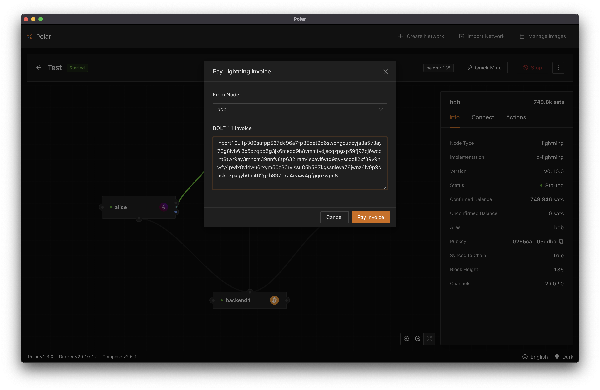

# Creating an Invoice in Code

We'll start the invoice coding journey by doing a very simple script to create the invoice. When run, our script will simply call the [`AddInvoice`](https://api.lightning.community/#addinvoice) GRPC API in LND to construct and return the invoice.

The script code is located in `server/scripts/CreateInvoiceScript.ts` if you want to see the full thing. The interesting bits are below:

```typescript
async function run() {
  // construct the options
  const options = await Options.fromEnv();

  // create the rpc client
  const lndRpcClient = new LndRpcClient(
    options.lndRpcHost,
    options.lndAdminMacaroon,
    options.lndCert
  );

  // create the invoice
  return lndRpcClient.addInvoice({
    memo: "Demo invoice",
    amt: 1000,
  });
}
```

You can see this script has three parts

1. Load the environment variables from the .env file we populated with Alice's node information
1. Construct a client to securely communicate with the LND node
1. Call the `AddInvoice` API with some info

When the script is run it will output result from calling `AddInvoice` which includes the encoded payment request.

## Exercise: Run the Create Script

To run the script, from the root of repository, run the command:

```
npm run script:create-invoice
```

Dev note: We're using an NPM script to help simplify running the script. When an NPM script runs it will first output the underlying command that it is trying to execute.

If you are successful you should see some output similar to:

```
$ npm run script:create-invoice

> building-lightning-invoices@1.0.0 script:create-invoice
> cd server; ts-node scripts/CreateInvoiceScript.ts

{
  r_hash: <Buffer 8f 9b 82 eb be 48 63 46 e5 6a 06 a0 e0 cd 18 e3 70 49 76 3d a3 23 d2 79 e8 3f d9 7d 7e 26 d3 44>,
  payment_request: 'lnbcrt10u1p309sufpp537dc96a7fp35det2q6swpngcudcyja3a5v3ay70g8lvh6l3x6dzqdq5g3jk6meqd9h8vmmfvdjscqzpgsp59fj97cj6wcdlht8twr9ay3mhcm39nnfv8tp632lram4sxaylfwtq9qyyssqqll2xf39v9nwfy4pwlx8vl4wu6rxym56z80rylssu85h587kgssnleva78jwnz4lv0p9dhcka7pxgyh6hj462gzh897exa4ry4w4gfgqnzwpu8',
  add_index: '22',
  payment_addr: <Buffer 2a 64 5f 62 5a 76 1b fb ac eb 70 cb d2 47 77 c6 e2 59 cd 2c 3a c3 a8 ab e3 ee eb 03 74 9f 4b 96>
}
```

You can now copy the `payment_request` value and try to pay with Bob in Polar.



As you can see, creating an invoice is pretty straight forward. This example relies on the node to create the preimage and the hash for the invoice. Try modifying the script to change the memo, amount, or creating a preimage.

Next we'll build a more complicated application using invoices.
