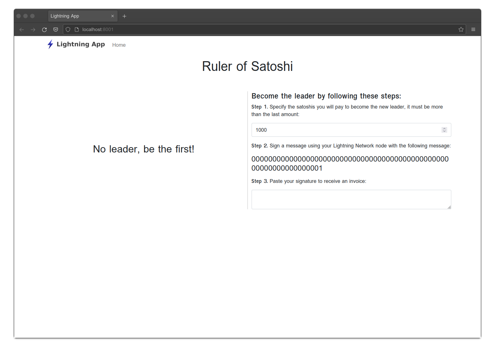
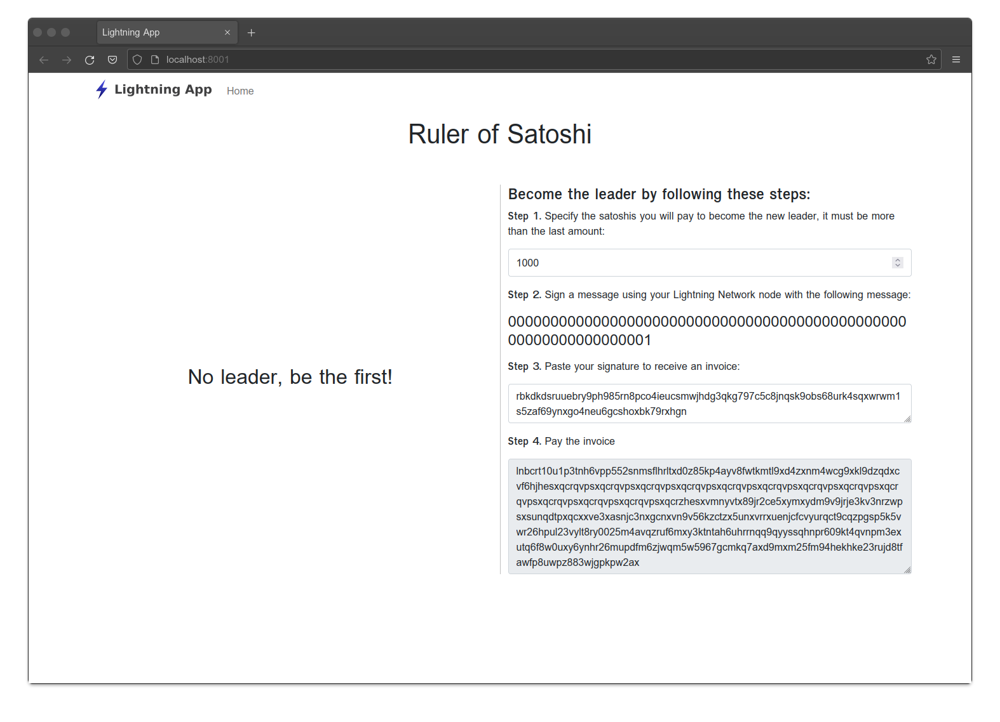
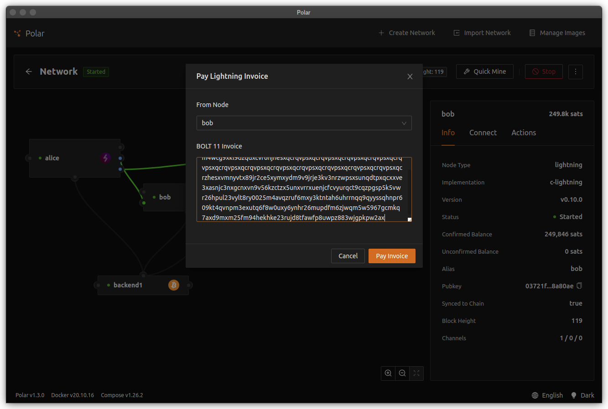
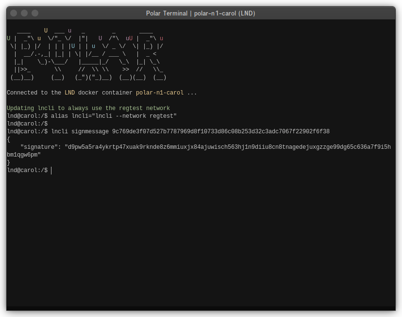
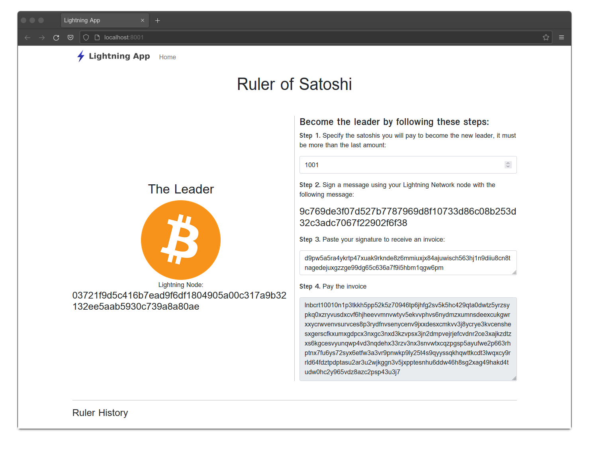

# Application Walk-Through

To keep things simple, the application we're going to create relies solely on our Lightning Network node. Instead of using a database system like PostgreSQL, we'll use the invoice database that is part of our node to keep track of the application state.

For our application we're going to use the Lightning Network and invoices to create a virtual game of [king of the hill](<https://en.wikipedia.org/wiki/King_of_the_Hill_(game)>). To play the game, someone becomes the leader by paying an invoice. Someone else can become the leader by paying a new invoice for more than the last leader. The neat thing is that any leader along the way can cryptographically prove they were the leader. In a sense, this application will act as a simple provenance chain for a "digital right" using Lightning Network invoices.

Let's see what our game looks like. Alice is running our application and is using LND as the backend. Bob is also running a network node and accesses Alice's website. Bob wants to become the first leader in the game.

The application is prompting Bob that he will need to pay 1000 satoshis. But to do this he must sign a message using his Lightning Network node. In this case, Bob needs to digitally sign the message `0000000000000000000000000000000000000000000000000000000000000001`.

Note: In Polar we can open a terminal by right-clicking on the node and selecting "Launch Terminal". With c-lightning, you can use the command `signmessage` to sign a message. It will return a signature in both hex and zbase32 formats. To simplify our application we'll use the zbase32 format since LND only interprets signatures in this format.

Now that Bob has a signature for the message, he provides the signature to the application's user interface. The server creates an invoice using Alice's Lightning Network node. This invoice is specific to Bob since he provided the signature. Alice's server returns the invoice to Bob via the user interface.

At this point, Bob can pay the invoice.

Once Bob has paid the invoice he is now the new leader of the game!

If Carol wants to become the new leader, she can sign the message `9c769de3f07d527b7787969d8f10733d86c08b253d32c3adc7067f22902f6f38` using her Lightning Network node.

Note: In Polar, we once again can use the "Launch Terminal" option. With LND, you can also use the CLI command `signmessage`. This will only return a zbase32 format signature, which is the format our application requires.

Carol provides this signature via the user interface and the Alice's server generates an invoice specifically for Carol to become the leader of the game at point `9c769de3f07d527b7787969d8f10733d86c08b253d32c3adc7067f22902f6f38`.

When Carol pays the invoice she will become the new leader!

Now that you have an understanding of how our application functions, we'll go through the algorithm for how it works.
