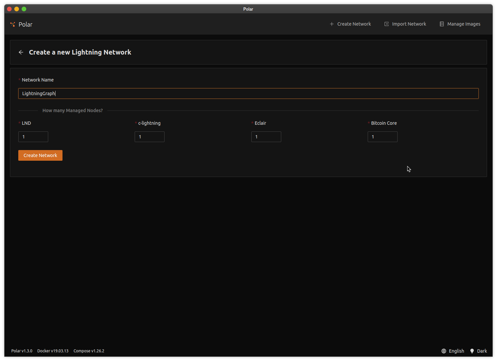
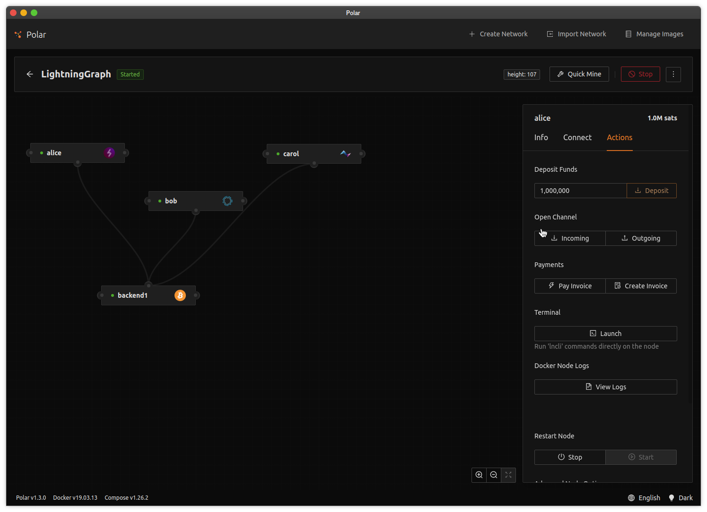
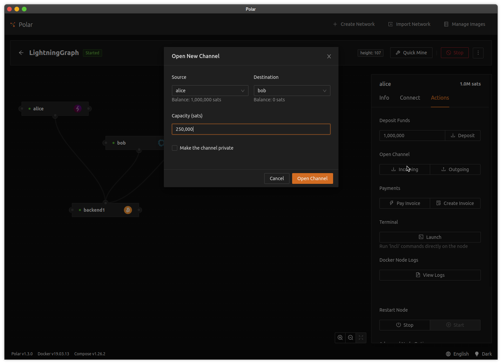

# Visualizing the Lightning Graph

Welcome to Building on Lightning! This series will acquaint you with tools and techniques you will need to build Lightning Network applications. The first application we will build is a visualizer of Lightning Network nodes and channels. The end result is that our application will have an interface that queries a Lightning Network node and receives real-time updates from that node.

This project uses [TypeScript](https://www.typescriptlang.org/) in the [Node.js](https://nodejs.org/en/) runtime. If you're not familiar with TypeScript, I suggest you do a tutorial to help you understand the code in this tutorial. Node.js is a popular runtime for web development. When combined with TypeScript it allows us to build large applications with compile-time type checking. This helps us reduce mistakes and properly structure our applications for future changes and developers.

This project also uses [Express](https://expressjs.com) as the web framework. It is a fast, easy to use, and popular web framework. Lastly this project uses [React](https://reactjs.org/) and [D3](https://d3js.org/) for creating the visualization of the Lightning Network graph.

## Environment Setup

We'll get started by setting up your environment. Since we're going to build a Lightning Network application it should not be surprising that our infrastructure consists of a Bitcoin node and one or more Lightning Network nodes that we can control.

As a user of Bitcoin and the Lightning Network you are most likely familiar with the main Bitcoin network. Bitcoin software actually has multiple networks that it can run on:

- mainnet - primary public network; the network a user interacts with.
- testnet - alternate network used for testing. It is typically smaller in size and has some other properties that make it useful for testing software built on top of Bitcoin. [More info](https://en.bitcoin.it/wiki/Testnet).
- regtest - regression testing network that gives us full control of block creation.

For creating and testing our Lightning Network applications we'll want our infrastructure to start with the regtest network to give us control and speed up our development process. At a future time we can transition to running in testnet or mainnet.

As you can imagine, getting all this running can be a chore. Fortunately, there is the tool [Polar](https://lightningpolar.com) that allows us to spin up Lightning network testing environments easily!

Our first step is to download and install Polar for your operating system from the [website](https://lightningpolar.com).

For a Linux system, it will be as an AppImage. You will need to grant executable rights to the file, then you can run the application.

Once Polar is running, you can create a new network. Polar allows us to run many different networks with varying configurations. For this application we will start the network with 1 LND node, 1 c-lightning node, 1 Eclair, and 1 Bitcoin Core node. Provide a name for this network.



Start the network once it has been created. Polar will launch Docker containers for each of the nodes in your network.

Polar also provides a few tools to allow us to easily perform common tasks.

We will start by depositing some funds into Alice's node. To do this, click on Alice's node, then click on the `Actions` tab.

We will then deposit 1,000,000 satoshis into Alice's node. When you click the `Deposit` button, the Bitcoin Core node running in regtest will create new blocks to an address and 0.01000000 bitcoin (1,000,000 satoshis) will deposited into an address controlled by Alice's Lightning Network node.



Now that Alice has some funds, she can create a channel with another node on the network. We can do this by opening an outgoing channel by clicking the `Outgoing` button in the `Open Channel` section of Alice's Actions tab.

Let's choose Bob as the channel counterparty and fund the channel with 250,000 satoshis.



We should now see a channel link between Alice and Bob in our channel graph.


At this point, we are ready to connect to Alice's node via the API.

## Development Setup

- ide ??
- install nodejs

- fork the repo
- run npm install

- repo walk through
- link to appendix on thorough discourse on building a template

### Connecting to Alice's node

vvvvvvvvvvvvvvvvvvvvvvvvvvv

To get started, we're going to clone

For this project, since we'll only be retrieving data we're going to use the LND REST API. The LND REST API provides swagger files, so we could use these to generate TypeScript references and a client. Because we're using a small subset of API's we'll create a simple client on our our own to retrieve the results

LND also has a gRPC API that can be used for streaming information about your node

https://api.lightning.community/#lnd-rest-api-reference

https://api.lightning.community/?#v1-graph

^^^^^^^^^^^^^^^^^^^^^^^^^^^^^

#### Configuring `.env` to Connect to LND

We're going to add few application options to help us connect to our LND node.

In this application we use the `dotenv` package to simplify environment variables. We can populate a `.env` file with key value pairs and the application will treat these as environment variables.

Remember that environment variables can be read in Node.js from the `process.env` object. So if we have an environment variable `PORT`:

```
$ export PORT=8000
$ node app.js
```

This environment variable can be read with:

```typescript
const port = process.env.PORT;
```

So lets start by adding some values to `.env`. We'll add four new environment variables:

- `LND_HOST` is the host where our LND node resides
- `LND_READONLY_MACAROON_PATH` is the file path to the readonly Macaroon
- `LND_CERT_PATH` is the certificate we use to securely connect with LND

Fortunately, Polar provides us with a nice interface with all of this information. Polar also conveniently puts files in our local file system to make our dev lives a bit easier.

In Polar, to access Alice's node click on Alice and then click on the `Connect` tab. You will be shown the information on how to connect to the GRPC and REST interfaces. Additionally you will be given paths to the network certificates and macaroon files that we will need in `.env`.


Go ahead and add the three environment variables defined above to `.env`. When you are done, your file should look something like:

```
# Express configuration
PORT=8001

# LND configuration
LND_HOST=https://127.0.0.1/8081
LND_READONLY_MACAROON_PATH=/home/lnuser/.polar/networks/1/volumes/lnd/alice/data/chain/bitcoin/regtest/readonly.macaroon
LND_CERT_PATH=/home/lnuser/.polar/networks/1/volumes/lnd/alice/tls.cert
```

#### Modify `Options.ts`

Now that our environment variables are in our configuration file, we need to get them into our application. The project comes with `app/Options.ts`. This class is where we will put properties that are needed to set up and control our application.

The class contains a factory method `fromEnv` that allows us to construct an `Options` instance from environment variables. We're going to modify the `Options` class to read our newly defined environment variables.

To do this, `Options` has a static property `Options.env` that maps the value of environment variables from `process.env` into known keys.

Start by modifying `app/Options.ts` by adding new properties on the `Options.env` mapping and reading the value from the corresponding environment variable.

The new properties to add to `env` are:

- LND_HOST
- LND_READONLY_MACAROON_PATH
- LND_CERT_PATH

After you add these value, your Options should look like:

```typescript
import "dotenv/config";

export class Options {
  public static env = {
    PORT: process.env.PORT,
    LND_HOST: process.env.LND_HOST,
    LND_READONLY_MACAROON_PATH: process.env.LND_READONLY_MACAROON_PATH,
    LND_CERT_PATH: process.env.LND_CERT_PATH,
  };

  public static async fromEnv(): Promise<Options> {
    for (const [key, value] of Object.entries(Options.env)) {
      if (!value) {
        throw new Error(`Required option ENV.${key} is not defined`);
      }
    }

    const port = Number(Options.env.PORT);

    return new Options(port);
  }

  constructor(readonly port: number) {}
}
```

Next we will need to create the properties on our `Options` object that will be read by our application. To do this, we modify the constructor and add some additional readonly arguments, similar to the existing `port` argument. In this case want to create:

- `lndHost` as a `string`
- `lndPort` as a `number`
- `lndReadonlyMacaroon` as a `Buffer`
- `lndCert` as a `Buffer`

Once you are done it will look like this:

```typescript
import "dotenv/config";
import fs from "fs/promises";

export class Options {
  public static env = {
    PORT: process.env.PORT,
    LND_HOST: process.env.LND_HOST,
    LND_PORT: process.env.LND_PORT,
    LND_READONLY_MACAROON_PATH: process.env.LND_READONLY_MACAROON_PATH,
    LND_CERT_PATH: process.env.LND_CERT_PATH,
  };

  public static async fromEnv(): Promise<Options> {
    for (const [key, value] of Object.entries(Options.env)) {
      if (!value) {
        throw new Error(`Required option ENV.${key} is not defined`);
      }
    }

    const port = Number(Options.env.PORT);

    return new Options(port);
  }

  constructor(
    readonly port: number,
    readonly lndHost: string,
    readonly lndPort: number,
    readonly lndReadonlyMacaroon: Buffer,
    readonly lndCert: Buffer
  ) {}
}
```

Most likely your IDE will be yelling at you right now as this code won't yet compile since our constructor is asking for five arguments and we're only supplying one in the `fromEnv` method. Don't worry, we'll get there next.

Note: In this example we use TypeScript's [Parameter Properties](https://www.typescriptlang.org/docs/handbook/2/classes.html#parameter-properties) feature. This feature creates class properties from `readonly` parameters. I like it because it saves a few keystrokes by removing the boilerplate of defining the property in the class, then assigning its value in the constructor. There are pros and cons to this approach, so feel free to construct your objects how think is best and in a way that is likely to reduce errors.

The last step we need is fix our compile error and supply our five arguments. You will note that I asked you to create the class properties as `Buffer` values. In the `fromEnv` method, we'll read the file's that are in the paths and use the resulting `Buffer` as the parameters to the constructor.

To do that we'll use `fs/promises` `readFile` method to perform an `async` read of the file contents.

Start by importing `fs/promises` at the top `Options.ts`:

```typescript
import fs from "fs/promises";
```

Then we create some variables by reading the files contents and assigning variables. Don't forget to cast `LND_PORT` into a number! You can use the `fs.readFile` method to read the contents of a file, such as:

```typescript
const contents: Buffer = await fs.readFile("path_to_some_file");
```

When all is done, `Options.ts` should be similal to:

```typescript
import "dotenv/config";
import fs from "fs/promises";

export class Options {
  public static env = {
    PORT: process.env.PORT,
    LND_HOST: process.env.LND_HOST,
    LND_PORT: process.env.LND_PORT,
    LND_READONLY_MACAROON_PATH: process.env.LND_READONLY_MACAROON_PATH,
    LND_CERT_PATH: process.env.LND_CERT_PATH,
  };

  public static async fromEnv(): Promise<Options> {
    for (const [key, value] of Object.entries(Options.env)) {
      if (!value) {
        throw new Error(`Required option ENV.${key} is not defined`);
      }
    }

    const port = Number(Options.env.PORT);
    const lndHost = Options.env.LND_HOST;
    const lndPort = Number(Options.env.LND_PORT);
    const lndReadonlyMacaroon = await fs.readFile(
      Options.env.LND_READONLY_MACAROON_PATH
    );
    const lndCert = await fs.readFile(Options.env.LND_CERT_PATH);

    return new Options(port, lndHost, lndPort, lndReadonlyMacaroon, lndCert);
  }

  constructor(
    readonly port: number,
    readonly lndHost: string,
    readonly lndPort: number,
    readonly lndReadonlyMacaroon: Buffer,
    readonly lndCert: Buffer
  ) {}
}
```

And with that, our application is has options to configure a connection to LND.

#### Creating an LND client

To connect to the LND REST API our project defines the `LndRestClient` class. Our first task is to modify our application startup to create an instance of this class. You will need to use the

```typescript
import { LndRestClient } from "./LndRestClient";
import { Options } from "./Options";
import { Server } from "./Server";

async function run() {
  const options = await Options.fromEnv();

  // Task: Create a LndRestClient
  const lnd: LndRestClient = undefined;

  const server = new Server(options);
  await server.setup();
  await server.listen();
}

run().catch((ex) => {
  console.error(ex);
  process.exit(1);
});
```

We will inject this client into our instance of the `Server` and will use it later to respond to make requests to the LND server.

To make this happen, define a property of the `LndRestClient` type in the `Server` class inside the `Server.ts` file.

```typescript
import express from "express";
import compression from "compression";
import bodyParser from "body-parser";
import { Options } from "./Options";
import { LndRestClient } from "./LndRestClient";

export class Server {
  public app: express.Express;

  constructor(readonly options: Options /* add parameter property */) {}

  public async setup() {
    this.app = express();
    this.app.use(bodyParser.json());
    this.app.use(compression());
  }

  public async listen(): Promise<void> {
    return new Promise((resolve) => {
      this.app.listen(Number(this.options.port), () => {
        console.log(`server listening on ${this.options.port}`);
        resolve();
      });
    });
  }
}
```

At this point, you application wont' compile. To get things working again, pass the `LndRestClient` instance you created in the previous exercise into the `Server` constructor in `index.ts`.

```typescript
import { LndRestClient } from "./LndRestClient";
import { Options } from "./Options";
import { Server } from "./Server";

async function run() {
  const options = await Options.fromEnv();
  const lnd = new LndRestClient(
    options.lndHost,
    options.lndReadonlyMacaroon,
    options.lndCert
  );
  const server = new Server(options); // FIX ME
  await server.setup();
  await server.listen();
}

run().catch((ex) => {
  console.error(ex);
  process.exit(1);
});
```

#### Create the Graph API

Since we're building a REST web service to power our front end application, we need to define an endpoint in our Express application.

In `Server.ts`, in the `setup` method we can add a request handler. We have a `getGraph` async method that is defined and have already created the mapping for the endpoint as `GET /api/graph` that will call this function.

In this exercise, use the `LndRestClient` that is part of the server to call the `graph` method. Return the results in a JSON response.

```typescript
import express from "express";
import compression from "compression";
import bodyParser from "body-parser";
import { Options } from "./Options";
import { LndRestClient } from "./LndRestClient";

export class Server {
  public app: express.Express;

  constructor(readonly options: Options, readonly lnd: LndRestClient) {}

  public async setup() {
    this.app = express();
    this.app.use(bodyParser.json());
    this.app.use(compression());
    this.app.get("/api/graph", (req, res, next) =>
      this.getGraph(req, res).catch(next)
    );
  }

  public async listen(): Promise<void> {
    return new Promise((resolve) => {
      this.app.listen(Number(this.options.port), () => {
        console.log(`server listening on ${this.options.port}`);
        resolve();
      });
    });
  }

  protected async getGraph(req: express.Request, res: express.Response) {
    // Obtain graph from LND Client and return it in a JSON response
  }
}
```

Dev Note: Express does not natively understanding `async` code but we can easily retrofit it. To do this we define the handler with a lambda function that has arguments for the `Request`, `Response`, and `next` arguments (has the type `(req, res, next) => void`). Inside that lambda, we then call our async code and attach the `catch(next)` to that function call. This way if our `async` function has an error, it will get passed to Express' error handler!

Once you have written this code, test our the server by running the `npm start` command and accessing `http://localhost:8001/api/graph. You should see information about the LND network. In this case, you should get a JSON result with two nodes (one for Alice and one for Bob) and a single edge for the channel between Alice and Bob.

## User Interface

Let's jump into the user interface! This application uses the React.js framework and D3.js. If you're not familiar with React, I suggest finding a tutorial to get familiar with the concepts and basic mechanics. We'll again be using TypeScript for our React code to help us add compile-time type-checking. There is an in-depth overview of building a project template in Appendix 2, so we'll just cover the basics in this section.

The user interface sub-project lives inside the `client` folder of our repository. Inside `client/src` is our application code.

The entry point of the application is `App.tsx`. This code uses `react-router` to allow us to link URLs to various scenes of our application. Once we've built-up our entry point we embed the application into DOM.

```typescript
// client/src/App.tsx
import React from "react";
import ReactDom from "react-dom";
import { BrowserRouter } from "react-router-dom";
import { LayoutScene } from "./scenes/layout/LayoutScene";

ReactDom.render(
  <BrowserRouter>
    <LayoutScene />
  </BrowserRouter>,
  document.getElementById("app")
);
```

From this you will see that we render a single component, `<LayoutScene>`. It lives inside the `client/src/scenes/layout` folder where we define things related to our application layout. Inside `LayoutScene` is also where we use `react-router` to define how our various scenes render based on the URL path.

```typescript
import React from "react";
import { Route, Routes } from "react-router-dom";
import { AppNav } from "./components/AppNav";
import { GraphScene } from "../graph/GraphScene";

export const LayoutScene = () => {
  return (
    <div className="layout">
      <div className="container-fluid mb-3">
        <AppNav />
      </div>
      <Routes>
        <Route path="/" element={<GraphScene />} />
      </Routes>
    </div>
  );
};
```

Here you can see that inside the `<Routes>` component we define a single `<Route>` that is bound to the root path `/` and it renders the `GraphScene` component which will be responsible for rendering our graph!

So our folder structure looks like this:

```
client\
  src\
    App.tsx
    scenes\
      layout\
        LayoutScene.tsx
      graph\
        GraphScene.tsx
```

And our code component hierarchy looks like this:

```
App
  LayoutScene
    GraphScene
```

Each of the scenes can also have components that are specific to the the scene. These are stored inside the `components` folder inside each scene.

```
client\
  src\
    App.tsx
    scenes\
      layout\
        LayoutScene.tsx
        components\
          NavBar.tsx
      graph\
        GraphScene.tsx
        components\
          Graph.tsx
```

Now that we've laid out how our application works let's build our application and see what happens. In the command line, navigate to the `client` folder and run the following command:

```
npm run watch
```

This command should build the React application and place it into the `dist` folder.

You can now use your browser to navigate to `http://localhost:8001` and view the application!


### Loading the Graph

Now that we're setup need to wire up the API code we created in the first section with our application. To make our life easier we will use an `ApiService` to abstract the calls to our API endpoint.

In your IDE, navigate to `/client/src/services/ApiService.ts` and create a method that uses the get helper `get` to retrieve

```typescript
// client/src/services/ApiService.ts
import { LightningGraph } from "./ApiTypes";

export class ApiService {
  constructor(readonly host: string = "http://127.0.0.1:8001") {}

  protected async get<T>(path: string): Promise<T> {
    const res = await fetch(path, { credentials: "include" });
    return await res.json();
  }

  // Exercise: Create a public fetchGraph method that returns Promise<LightningGraph>.
  // You can use the get helper method above by supplying it with an API path.
}
```

This API service is conveniently available inside the `useApi` hook located in the `hooks` folder. By adding our `fetchGraph` method to the `ApiService`, we can gain access to it by using the `useApi` hook inside any component!

So let's point our IDE at the `GraphScene` component and see if we can wire up the API call for the graph to the scene.

For this exercise, inside the `useEffect` hook, call the api's `fetchGraph` method. Be mindful that this method returns a promise, which you will need to retrieve the results from. To test your code, simply log the results to the console.

```typescript
import React, { useEffect, useRef } from "react";
import { useApi } from "../../hooks/UseApi";
import { Graph } from "./components/Graph";

export const GraphScene = () => {
  const api = useApi();
  const graphRef = useRef<Graph>();

  useEffect(() => {
    // Exercise: Using the api, call the fetchGraph method. Since this returns a promise,
    // we need to use the `then` method to retrieve the results. With the results, call
    // `graphRef.current.createGraph` and add a console.log statement so you see the graph.
  }, []);

  return (
    <div className="container-fluid h-100">
      <div className="row h-100">
        <div className="col h-100">{<Graph ref={graphRef} />}</div>
      </div>
    </div>
  );
};
```

Dev Note: The `useEffect` hook has two arguments: a callback function and an array of variables that when changed will trigger the callback function. Providing an empty array means our callback function will only be called when the component mounts, which is the functionality we are looking for.

Dev Note: [Promises](https://developer.mozilla.org/en-US/docs/Web/JavaScript/Reference/Global_Objects/Promise) are a mechanism for working with asynchronous operations. When a promise completes, the results are available in the `then` method.

When you refresh your browser, the background will now be gray but you won't yet see the graph yet. If you open your developer tools, you will see the graph output that you wrote with console.log!


We don't yet see the graph because haven't fully implemented the `createGraph` method in the `<Graph>` component. This method is responsible for converting our `LightningGraph` object into objects that can be used by D3.

Our `LightningGraph` object has two arrays: `nodes` and `channels`.

Each `LightningNode` object has three properties that we will use:

- `pubkey` - a string that is the unique identifier for the node
- `color` - the color of the node that is specified by the node operator
- `alias` - the friendly name of the node that is specified by the node operator

Each `LightningChannel` object has three properties that we will use:

- `id` - the unique identifier for the channel
- `node1PubKey` - the identifier for the first node, when sorted, of the channel
- `node2PubKey` - the identifier for the second node, when sorted, of the channel

Using this information we need to construct new objects that can be controlled by D3. We need to do
this because D3 will store rendering state on the objects. We don't want D3 to mutate the original
objects so we'll construct new ones that D3 can control.

This gets us to our next exercise. We need to modify the `Graph` component's `createGraph` method
to convert our Lightning graph objects into D3 controlled objects. To do this we create two arrays:

- one array for the graph's nodes created from our `LightningNode` where our `pubkey` is the `id`,
  and the `alias` is the D3 node's title.
  ```typescript
  interface D3Node {
    id: string;
    color: string;
    title: string;
  }
  ```
- one array for the graph's links created from our `LightningChannel` objects where the `id` is the
  `channelId` and the `source` and `target` are the node pubkeys.
  ```typescript
  interface D3Link {
    id: string;
    source: string;
    target: string;
  }
  ```

```typescript
// client/src/scenes/graph/components/Graph.tsx

    createGraph(graph: LightningGraph) {
        // map the graph's nodes into d3 nodes
        this.nodes = [];

        // map the graph's channels into d3 links
        this.links = [];
```

Once we have created these maps we can refresh our browser and we should
see the current graph!


## Real Time Server Updates

At this point we've successfully connected our user interface to a REST server! However what happens
if a new channel is created or a new node creates a channel? Our Lightning Network nodes will have
new graph information but we would need to manually refresh the page.

Go ahead and give it a try by creating a channel between Bob and Carol. When we refresh the browser
we should see a new link between Bob and Carol.

This is ok, but we can do better by passing updates to our user interface using WebSockets.

The WebSocket code on our server uses the [ws]() library and lives inside
the `SocketServer` class. This class maintains a set of connected sockets.
It also includes a `broadcast` method that allows us to send data for some
channel to all connected sockets.

```
{
  channel: string,
  data: T
}
```

This class is covered in more depth in [Appendix 1](appendix_1).

The last bit of code for WebSockets lives inside `server/src/index.ts`.
At the end of the `run` method, we create the `SocketServer` instance and
have it listen to the HTTP server for connections.

```typescript
// server/src/Server.ts
async function run() {
    // OTHER CODE IS HERE...

  // start the server on the port
    const server = app.listen(Number(options.port), () => {
        console.log(`server listening on ${options.port}`);
    });

    // start the socket server
    const socketServer = new SocketServer();

    // start listening for http connections
    socketServer.listen(server);
```

Back in our server code's `LndGraphService` is a method `subscribeGraph` that we need to modify. This
method subscribes to LND API's `subscribeGraph` method. We need to impl.ement this method to convert LND's
graph updates into our `LightningGraphUpdate` type and fire an event

```typescript
  public async subscribeGraph(): Promise<void> {
        // Exercise:
        // 1. Using the LND Client, subscribe to graph updates using the
        //    `subscribeGraph` method
        // 2. Handle each update by converting the LND `GraphUpdate` into
        //    a `LightningGraphUpdate` used by our application
        // 3. Emit the `LightningGraphUpdate` with this.emit("update", update);
  }
```

Dev Note: This class is an [EventEmitter](). EventEmitters can use the
`emit` method to tell other classes that something has happened. These
other classes are "observers" and can listen using the `on` method.
Using EventEmitters allows us to keep code decoupled and avoid messy
callback nesting.

Once you have implemented `subscribeGraph` we need to do two things:

1. have the server subscribe to updates
2. send those updates to any connected WebSockets

To add these features we'll add them to the bottom out `Server.ts`.

```typescript
// server/src/Server.ts

async function run() {
  // other code is here...

  // start the socket server
  const socketServer = new SocketServer();

  // start listening on the socket
  socketServer.listen(server);

  // Exercise: On the `lndGraphService`, attach an event handler for
  // graph updates and broadcast them to all WebSockets using
  // socketServer.broadcast. You can pick a channel name, such as "graph".

  // subscribe to graph updates
  lndGraphAdapter.subscribeGraph();
}
```

That's all there is to it! You should now be able to connect a WebSocket
to the server and receive updates.

To test this code, you can generate graph updates by closing or
opening a channel.

## Real Time User Interface

## Further Exploration

- add additional information to the graph, this will require add additional information to the
  `LightningGraph` and modifying the plumbing
- connect to c-lightning or eclair, this will require code to connect with each API and an adapter
  our `LightningGraph` type used by our application.
- connect to testnet mainnet, this will require restricting the results of the graph size!

```

```
